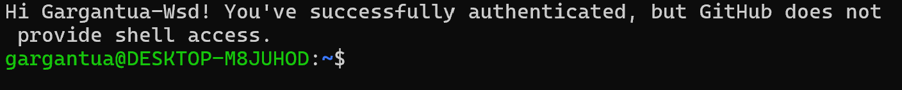
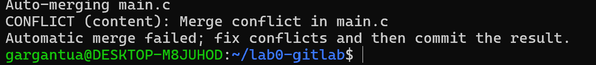
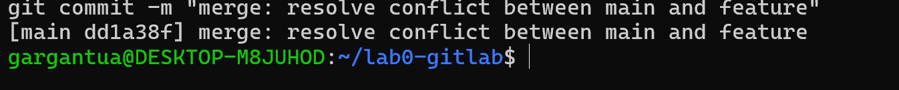
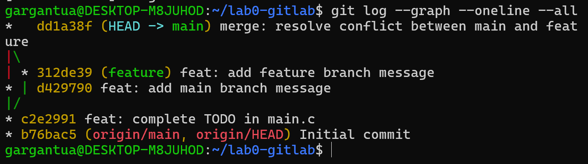

# Lab0 实验报告

| 姓名 | 谷承霖 | 学号 | 24300680080 |
| --- | --- | --- | --- |
| 实验日期 | 2026 年 9 月 17 日 | 实验环境 | Windows 11 + WSL2 (Ubuntu 22.04) |

个人仓库：<https://github.com/Gargantua-Wsd/lab0-gitlab>

---

## 一、思考题

### 1. 你之前有过多人协同开发的经历吗？

有，但方式比较原始。做小组作业时我们靠人工约定来分工：每人负责自己的那部分文件，尽量不碰别人的；需要改同一个文件时先在群里说一声，改完把文件发到群里，由负责整合的同学统一合并。

这套办法能用，但问题很明显：两个人只要同时改了一个文件，就只能把两份摊开来一行行对比；而且一旦有人误传了旧版本覆盖新版本，之前的工作就白做了。这次学了 Git 才明白，分支其实就是把我"复制一份文件夹备份"的做法规范了——区别在于 Git 会精确记住每个分支相对共同祖先改了哪些行，合并时按行自动完成，只有真正撞在同一行时才需要人来判断。

### 2. Git 为什么要设计"暂存-提交"两个步骤？

我认为有三个原因。

**一是让一次提交成为一件完整的事。** 工作区里的改动往往是零散的——改到一半的函数、顺手调的缩进、调试时临时加的打印语句。如果每改一次就提交一次，历史会变成一堆没有意义的碎片。有暂存区，就可以把若干改动攒起来，确认它们共同构成一个完整的功能后一次性提交。

**二是暂存区是一个可以反悔的缓冲区。** `git add` 之后发现加错了文件，`git restore --staged` 就能取出来，工作区内容不动，提交历史也不留痕迹。如果没有这一层，`git add` 就等于 `git commit`，任何一次手滑都得去改写已经产生的历史，成本高得多。

**三是它让"部分提交"成为可能。** 一个文件改了两个地方，一个是修 bug、一个是加功能，本来应该分成两次提交。有暂存区我就能只把其中一部分先提交，剩下的留着下次。这样之后用 `git revert` 撤销时，粒度可以精确到"只撤那个 bug 修复"，而不用把整个文件改回去。

### 3. `git branch` 和 `git branch -a` 的区别是什么？

`git branch` 只列出**本地分支**，在当前所在分支前标 `*`。

`git branch -a`（`-a` 是 `--all`）会把**远程跟踪分支**也列出来，以 `remotes/origin/<名字>` 的形式显示。

关键在于远程跟踪分支**不是可以直接修改的分支**。`remotes/origin/main` 是 Git 在最近一次 `fetch` / `push` / `pull` 时，为远程的 `main` 分支在本地留的一份"只读快照"，我不能对它提交。它的用途是告诉我远程现在有哪些分支、本地相对它领先或落后多少——这也是 `git push` 时 Git 能判断能否快速合并的依据。

日常确认自己在哪个本地分支，用 `git branch` 就够了；想知道远程有没有别人新推上来的分支、自己是不是落后了，才需要用 `git branch -a`。

---

## 二、阅读材料概要

> 从三篇中选读了《Commit Message 规范》和《Git Flow 分支控制》两篇。

### 1. Commit Message 规范

讲的是提交信息该怎么写，核心是一套源自 Angular 的格式约定。

格式分三段：**Header**（必填）形如 `type(scope): subject`，其中 `type` 是改动类别（`feat` 新功能、`fix` 修 bug、`docs` 文档、`refactor` 重构、`chore` 杂务等），`scope` 说明影响范围，`subject` 要求动词开头、小写、不加句号；**Body**（可选）说明改动的**原因**，而不是重复代码差异里就能看到的"改了什么"；**Footer**（可选）标注不兼容变更或关联的 issue。

规范的好处是历史便于浏览、便于按类型筛选，还能据此自动生成 Change log。文章也介绍了配套工具：Commitizen 引导填写、validate-commit-msg 校验格式、conventional-changelog 自动生成日志。

我的理解是，这套规范的价值不在格式好看，而在于它把提交信息从随手写的一句话变成了**可以被程序消费的结构化数据**——`type` 一旦是枚举值而不是自由文本，自动化工具才真正用得上。

### 2. Git Flow 分支控制

介绍的是 Git Flow 分支管理模型，一套面向"有计划地发布版本"的协作流程。

它有两条长期分支：`master`/`main` 只存线上已发布的稳定版本，`develop` 是开发主线。还有三类临时分支，各自的来源和归宿都有明确规定：`feature/*` 从 `develop` 切出、做完合回 `develop`；`release/*` 从 `develop` 切出做上线前准备，通过后同时合回 `master`（并打 tag）和 `develop`；`hotfix/*` 在线上出紧急 bug 时从 `master` 切出，修好同时合回两边。

我觉得 Git Flow 最值得学的是它的**思路**：给每条分支规定唯一的来源和归宿，把"什么时候能进主线"变成流程问题而不是纪律问题。`release` 分支的设计尤其巧妙，它让"准备发版"和"继续开发新功能"能同时进行而互不阻塞。

不过它对持续交付的场景显得偏重，分支多、合并多，维护成本高，现在不少团队转向更轻量的 GitHub Flow。所以我理解学 Git Flow 的意义在于"分支策略要匹配团队的发版节奏"，而不是当成必须照搬的模板——这次 Lab 里只用一个 `feature` 分支，就是最简化版的做法。

### 3. 为什么要学习 Git

上面两篇材料其实在回答同一个问题：很多人同时改同一份代码时，怎么让事情不乱。Git 用分支做隔离、用合并做汇合、再用规范的提交信息让汇合时人能看懂发生了什么。这次实验里我在 `main` 和 `feature` 上改了同一行，merge 立刻报冲突，那一刻才具体体会到——没有这套机制，冲突只能靠人对着屏幕一行行看，而且一定会漏。

另一个体会是，有了版本控制我才敢放手改代码。以前改完不知道能不能回去，要么不敢动，要么先复制一份备份；现在任何一个通过测试的状态都是可以随时回去的锚点，试错成本降下来，人才愿意尝试更好的写法。所以我觉得 Git 不只是个工具，而是进入现代软件开发的准入条件。

---

## 三、实验步骤

### 1. 配置环境与 SSH

在 WSL2 的 Ubuntu 22.04 中配置提交身份：

```bash
git config --global user.name "Gu Chenglin"
git config --global user.email "1470688049@qq.com"
git config --global init.defaultBranch main
```

其中邮箱与 GitHub 账号的注册邮箱保持一致，这样远程仓库的提交记录才能归属到我的账号上。

接着生成 Ed25519 密钥对并把公钥添加到 GitHub 的 SSH keys 中：

```bash
ssh-keygen -t ed25519 -C "1470688049@qq.com"
cat ~/.ssh/id_ed25519.pub
```

验证连接：

```bash
ssh -T git@github.com
```

**图 1　SSH 配置验证通过**



### 2. 克隆仓库并完成 `main.c` 的 TODO

在 GitHub 上以模板仓库建立个人仓库后克隆到本地：

```bash
git clone git@github.com:Gargantua-Wsd/lab0-gitlab.git
cd lab0-gitlab
```

模板中 `main.c` 的 `TODO` 是打印一句话。修改后先编译运行确认无误，并在提交前执行 `make clean` 清掉编译产物：

```bash
make && ./main && make clean
git add main.c
git commit -m "feat: complete TODO in main.c"
```

得到提交 `c2e2991`。

### 3. 建立 feature 分支并制造冲突

题目的要求是：两个分支各自改动后再合并，必须产生冲突。而冲突产生的条件是**两个分支修改了同一文件的同一位置**。

因此我让两个分支都去修改 `main.c` 里新增的那一行。

先创建并切换到 `feature` 分支，把该行改成 feature 版本：

```bash
git switch -c feature
git add main.c
git commit -m "feat: add feature branch message"
```

得到提交 `312de39`。

再切回 `main` 分支，把**同一行**改成不一样的内容：

```bash
git switch main
git add main.c
git commit -m "feat: add main branch message"
```

得到提交 `d429790`。

此时两个分支从同一个提交分叉，且各自修改了同一行，满足冲突条件。执行合并：

```bash
git merge feature
```

**图 2　合并出现冲突**



### 4. 解决冲突并完成合并

冲突时 Git 在文件里用三行标记把两个版本并列标出：

```c
<<<<<<< HEAD
    printf("24300680080: this line is written in the main branch.\n");
=======
    printf("24300680080: this line is written in the feature branch.\n");
>>>>>>> feature
```

其中 `HEAD` 段是当前分支（`main`）的内容，`feature` 段是要合并进来的内容。

**冲突原因**：两个分支都修改了同一行且结果不同。Git 的自动合并是以"行"为单位对比三方（共同祖先、`main`、`feature`）来做的——只有当一方改了某行、另一方保持原样时，Git 才能安全地采用修改过的那一份。两边都改了同一行且不一致时，Git 无法判断哪一份才对，也不应该替开发者猜测，所以把决定权交回给人，用冲突标记把两个版本都保留在文件里。

**解决办法**：手动编辑 `main.c`，删掉 `<<<<<<<`、`=======`、`>>>>>>>` 这三行标记，保留需要的内容。这里我选择两行都保留，因为它们分别记录了两次提交的改动。解决后重新暂存并提交，完成合并：

```bash
git add main.c
git commit -m "merge: resolve conflict between main and feature"
```

得到合并提交 `dd1a38f`。

**图 3　冲突已解决，合并提交成功**



### 5. 查看提交历史

```bash
git log --graph --oneline --all
```

可以看到 `feature` 与 `main` 分叉后又通过合并提交汇合的结构：

**图 4　提交历史的分叉与汇流**



### 6. 提交报告并推送到远程

在仓库根目录添加本报告和 `docs/` 下的截图，然后推送到 GitHub：

```bash
git add .
git commit -m "docs: add Lab0 report"
git push origin main
git push origin feature
```

最后在 E-Learning 平台提交仓库链接。

---

## 四、遇到的问题与建议

**遇到的两个小问题：**

一是 `ssh -T git@github.com` 一开始卡住不返回。排查后确认是网络封了 22 端口。解决办法是在 `~/.ssh/config` 里让 GitHub 的 SSH 连接改走 443 端口，改完立刻通了。这里的心得是：命令"卡住"和"报错"是两类不同的问题，前者通常是网络层的，不该往认证配置的方向查。

二是 `make` 之后忘了 `make clean`，`git status` 里多出 `main` 和 `main.o` 两个未跟踪文件，差点一起提交进去。后来养成了提交前先看一眼 `git status` 的习惯。

**两点建议：**

第一，文档正文很长，但需要动手的部分集中在后半段的"实验任务"。建议在开头加一个指向该小节的锚点链接，方便直接跳到重点。不过概念部分的示意图质量很高，尤其 `git merge` 那里画的 Fast-forward 与非 Fast-forward 对比，把两种合并结果的差别讲得非常清楚。

第二，关于冲突任务，建议直接点明"**两个分支修改同一行**"这个条件。文档说"请阅读 git merge 部分，思考如何修改 main.c 会出现冲突"，我自己试了几次才摸到窍门，如果能明说可以省掉不少时间。

---

## 附：提交记录

```
* dd1a38f (HEAD -> main) merge: resolve conflict between main and feature
|\
| * 312de39 (feature) feat: add feature branch message
* | d429790 feat: add main branch message
|/
* c2e2991 feat: complete TODO in main.c
* b76bac5 (origin/main, origin/HEAD) Initial commit
```
